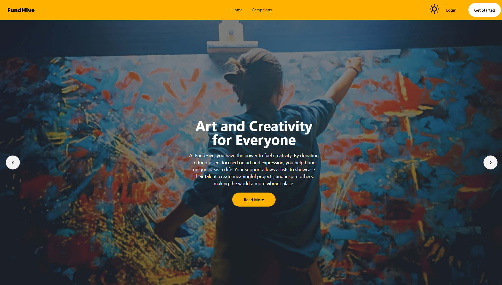

# 🚀 FundHive - Crowdfunding Platform

<div align="middle">

</div>

## 📌 Overview

**FundHive** is a dynamic crowdfunding platform that empowers users to raise funds for personal, creative, and startup projects. Whether it's medical expenses, launching a new product, or supporting an art initiative, FundHive connects you with a generous community of backers ready to support your vision.

🔗 **[Live Project](https://fund-hive.web.app/)**

## ✨ Features

✅ **Create Campaigns** – Easily launch fundraising campaigns for various needs.  
✅ **Fundraising Tools** – Track progress, engage with supporters, and manage funds.  
✅ **Secure Transactions** – Ensures safety with industry-standard encryption.  
✅ **Community Support** – Connect with a network of backers eager to help.

## 🛠 Tech Stack

- **Frontend**: React.js
- **Backend**: Node.js, Express.js
- **Database**: MongoDB
- **Authentication**: Firebase

## 📦 Dependencies

```json
"dependencies": {
  "firebase": "^9.0.0",
  "sweetalert2": "^11.0.0",
  "daisyui": "^2.51.3",
  "tailwindcss": "^3.0.24",
  "react-router-dom": "^6.3.0",
  "react-tooltip": "^4.2.21",
  "react-toastify": "^9.0.0",
  "react-spinners": "^0.11.0",
  "react-awesome-reveal": "^3.8.0"
}
```

## 🚀 How to Run the Project Locally

1. **Clone the Repository:**

   ```sh
   git clone https://github.com/tahmidjihan/fundHive.git
   cd fundhive
   ```

2. **Install Dependencies:**

   ```sh
   npm install
   ```

3. **Set Up Firebase:**

   - Create a `.env` file and add Firebase credentials.

   ```env
   VITE_API_KEY=your_one
   VITE_AUTH_DOMAIN=your_one
   VITE_PROJECT_ID=your_one
   VITE_STORAGE_BUCKET=your_one
   VITE_MESSAGING_ID=your_one
   VITE_APP_ID=your_one
   VITE_MEASUREMENT_ID=your_one
   ```

4. **Run the Development Server:**

   ```sh
   npm run dev
   ```


## 📎 Resources
- 🔗 **[Live Project](https://fund-hive.web.app/)**
- 📖 **[Firebase Docs](https://firebase.google.com/docs/)**
- 🎨 **[Tailwind CSS Docs](https://tailwindcss.com/docs/)**
- 🔧 **[React Router Docs](https://reactrouter.com/docs/en/v6/getting-started/overview)**
